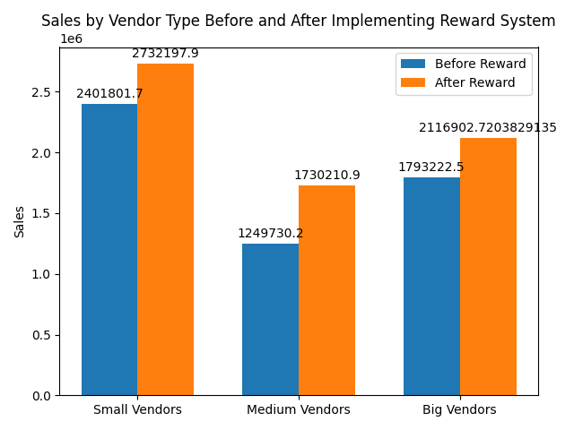

# **ECell-x-NPCI-Hackathon Business Model**

## **Overview**

The **ECell-x-NPCI Hackathon** organized by the Entrepreneurship Cell, IIT Hyderabad, presents an opportunity to create an innovative **Unified Reward System** for retail vendors and customers. The system aims to integrate small, medium, and large vendors into a centralized platform that drives customer loyalty and enhances vendor profitability.

---

## **1) Proof of Concept**

### **Unified Reward System for Retail Vendors and Customers**

This platform is designed to allow customers to earn and redeem reward points across various vendors through a mobile app. The rewards are structured differently based on the size of the vendor.

### **Key Features**

- **Small Vendors:**
  - Customers earn points after crossing spending thresholds.
  - Points are non-redeemable, incentivizing higher spending.
  
- **Medium Vendors:**
  - Redeemable points that offer discounts on future purchases.

- **Big Vendors:**
  - Flexible reward redemption policies.
  - Big data analytics to understand customer trends and optimize inventory management.

### **Benefits**
- **Customer Engagement:** Encourages higher customer spending and repeat visits.
- **Data Insights:** Provides actionable insights for vendors using big data analytics.
- **Customer Retention:** Boosts loyalty with personalized rewards based on spending behavior.

---

## **2) Database Implementation**

### **Customer Loyalty and Rewards System**

This Python-based implementation uses **SQLite** for in-memory database management. It includes customer data, transaction tracking, and real-time visualizations for insights.

### **Features**
- **Database Setup:**
  - Tables for **Customers**, **Vendors**, **Transactions**, **Rewards**, **Products**, and **Analytics**.
  
- **Sample Data:**
  - Pre-filled data (5 entries per table) for demonstration.

- **Visualizations:**
  - Real-time dashboards using **Matplotlib** to visualize:
    - Transaction volumes per vendor.
    - Reward points issued vs. redeemed.
    - Profitability trends (Revenue minus rewards).

### **Key Functions**
- Display tables using **Tabulate**.
- Analyze transactions, rewards, and profitability.
- Generate bar and line charts for insightful data visualization.

---

## **3) Technical Implementation**

### **Advanced Features and Future Enhancements**

#### **Blockchain Integration**
- **Objective:** Improve security and transparency in the reward system.
- **Features:** Immutable transaction records, transparent point tracking, and a secure ledger.
- **Impact:** Increased trust and reduced fraud in the system.

#### **AI-Powered Recommendations**
- **Objective:** Use AI to provide personalized product recommendations based on customer behavior.
- **Features:** Behavioral insights and suggestions tailored to individual preferences.
- **Impact:** Increases engagement, boosts sales, and improves customer experience.

#### **Multi-Currency Support**
- **Objective:** Extend the system’s global reach by enabling multi-currency support.
- **Features:** Currency conversion and automatic adjustments based on exchange rates.
- **Impact:** Expands the platform’s reach to international customers.

---

## **4) Vendor Reward System Simulation**

### **Overview**

This simulation models customer behavior before and after implementing a reward system. By simulating different customer transactions at small, medium, and big vendors, the project demonstrates the effectiveness of loyalty programs in driving sales and customer engagement.

### **Features**
- **Before Reward Simulation:** 
  - Random customer transactions at various frequencies and amounts across vendor types.
  
- **After Reward Simulation:**
  - Loyalty points are introduced, motivating customers to increase their spending.

- **Threshold-Driven Spending:**
  - Customers are incentivized to cross spending thresholds to earn more points.

- **Sector-Specific Engagement:**
  - Higher engagement is observed in fast food and entertainment sectors due to reward programs.

### **Libraries Used**
- **Pandas:** For data processing and handling transaction data.
- **NumPy:** For generating random numbers and simulating customer behavior.
- **Matplotlib:** For visualizing sales data.

### **Code Explanation**

#### **`before_reward()`**
Simulates transactions before rewards are implemented. It calculates total sales for small, medium, and big vendors.

#### **`after_reward()`**
Simulates customer behavior post-reward system implementation, where loyalty points are earned and redeemed based on spending.

### **Key Simulations**
- **Threshold-Driven Spending:** Customers increase spending when rewards are in play.
- **Increased Engagement with Fast Food and Entertainment Sectors:** More frequent visits and higher transaction amounts are observed.

### **Output**
- Average sales before and after the reward system across different vendor types.
- Bar chart comparing sales before and after the reward system.

### **Example Output:**

---

 
